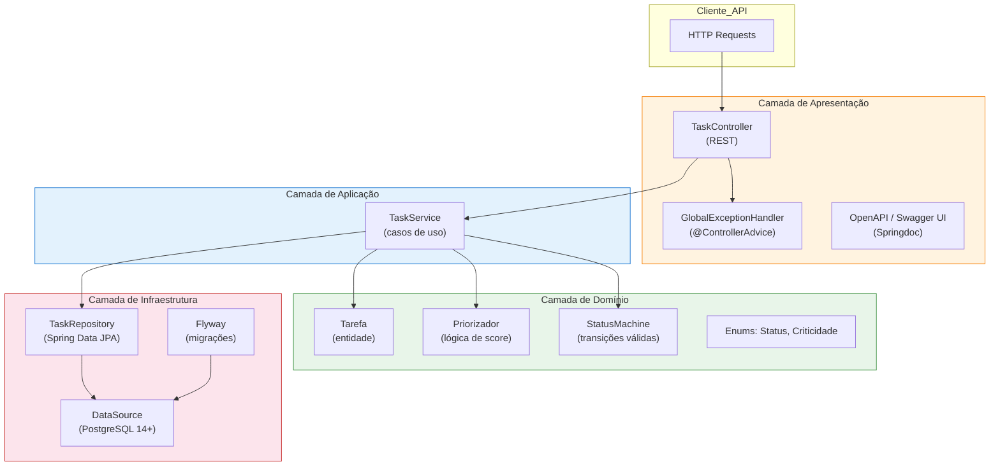
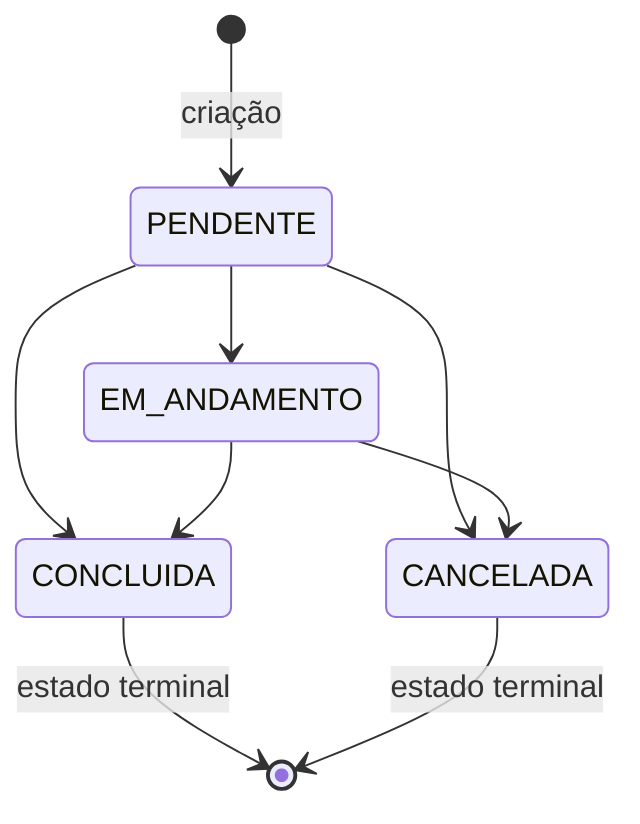

# Design Document — TaskFlow API

## Overview

A TaskFlow API é uma API REST para gerenciamento de tarefas com priorização automática. O sistema expõe operações de CRUD sobre a entidade `Tarefa` e calcula automaticamente um `Score_Prioridade` (0–100) para cada tarefa ativa com base em criticidade declarada, proximidade do prazo e idade da tarefa. A prioridade nunca é informada pelo cliente — é sempre derivada pelo componente `Priorizador`.

**Stack tecnológica:**
- Java 21
- Spring Boot 3.x
- PostgreSQL 14+
- Maven
- Flyway (migrações de esquema)
- Springdoc OpenAPI 3.x
- GitHub Actions (CI/CD)

---

## Architecture

### Padrão Arquitetural: Arquitetura em Camadas (Layered Architecture)

**Justificativa:** Para uma API REST de domínio bem delimitado como a TaskFlow, a arquitetura em camadas (Presentation → Application → Domain → Infrastructure) oferece a melhor relação custo-benefício:

- O domínio é coeso e centrado em uma única entidade (`Tarefa`) com regras de negócio claras e estáveis.
- A Arquitetura Hexagonal (Ports & Adapters) seria mais adequada se houvesse múltiplos adaptadores de entrada/saída (ex.: mensageria, múltiplos bancos) ou necessidade de isolar o domínio de frameworks para testes de longa duração — o que não é o caso aqui.
- A separação em camadas já garante testabilidade do domínio (o `Priorizador` e as regras de `Tarefa` são POJOs puros, sem dependência de Spring ou JPA).
- A complexidade adicional de interfaces de porta/adaptador não se justifica para o escopo atual.

**Camadas:**

| Camada | Responsabilidade |
|---|---|
| **Presentation** | Controllers REST, DTOs de request/response, tratamento de exceções HTTP |
| **Application** | Casos de uso (serviços de aplicação), orquestração entre domínio e infraestrutura |
| **Domain** | Entidades, value objects, enums, regras de negócio, `Priorizador` |
| **Infrastructure** | Repositórios JPA, entidades de persistência, configurações de banco |


### Diagrama de Arquitetura



---

## Components and Interfaces

### Package Structure

```
br.com.taskflow
├── presentation
│   ├── controller
│   │   └── TaskController.java
│   ├── dto
│   │   ├── request
│   │   │   ├── CreateTaskRequest.java
│   │   │   ├── UpdateTaskRequest.java
│   │   │   └── TransitionStatusRequest.java
│   │   └── response
│   │       ├── TaskResponse.java
│   │       └── ErrorResponse.java
│   └── exception
│       └── GlobalExceptionHandler.java
├── application
│   └── service
│       └── TaskService.java
├── domain
│   ├── model
│   │   └── Tarefa.java
│   ├── enums
│   │   ├── Criticidade.java
│   │   └── StatusTarefa.java
│   ├── service
│   │   ├── Priorizador.java
│   │   └── StatusMachine.java
│   └── exception
│       ├── TarefaNaoEncontradaException.java
│       ├── TransicaoInvalidaException.java
│       └── TarefaEncerradaException.java
└── infrastructure
    ├── persistence
    │   ├── entity
    │   │   └── TarefaEntity.java
    │   ├── repository
    │   │   └── TaskJpaRepository.java
    │   └── mapper
    │       └── TarefaMapper.java
    └── config
        └── OpenApiConfig.java
```


### Key Component Interfaces

**TaskService** — orquestra todos os casos de uso:
```java
public interface TaskService {
    TaskResponse create(CreateTaskRequest request);
    TaskResponse findById(UUID id);
    Page<TaskResponse> findAll(StatusTarefa status, Criticidade criticidade, Pageable pageable);
    TaskResponse update(UUID id, UpdateTaskRequest request);
    TaskResponse transition(UUID id, TransitionStatusRequest request);
    void delete(UUID id);
}
```

**Priorizador** — componente de domínio puro (sem dependências de framework):
```java
public class Priorizador {
    public int calcular(Tarefa tarefa, Instant referencia);
}
```

**StatusMachine** — valida e executa transições:
```java
public class StatusMachine {
    public void validarTransicao(StatusTarefa atual, StatusTarefa destino);
    // lança TransicaoInvalidaException ou TarefaEncerradaException
}
```

---

## Data Models

### Domain Model

#### Enum: `Criticidade`
```java
public enum Criticidade {
    BAIXA, MEDIA, ALTA, URGENTE;
    // peso para cálculo: BAIXA=1, MEDIA=2, ALTA=3, URGENTE=4
}
```

#### Enum: `StatusTarefa`
```java
public enum StatusTarefa {
    PENDENTE, EM_ANDAMENTO, CONCLUIDA, CANCELADA
}
```

#### Entidade de Domínio: `Tarefa`
```java
public class Tarefa {
    private UUID id;
    private String titulo;
    private String descricao;          // nullable
    private Instant prazo;
    private Criticidade criticidade;
    private StatusTarefa status;
    private int scorePrioridade;
    private Instant criadoEm;
    private Instant atualizadoEm;
    private Instant concluidoEm;       // nullable, preenchido ao concluir
}
```

### Database Schema (Flyway Migration V1)

```sql
CREATE TABLE tarefas (
    id              UUID        NOT NULL DEFAULT gen_random_uuid(),
    titulo          VARCHAR(255) NOT NULL,
    descricao       TEXT,
    prazo           TIMESTAMPTZ NOT NULL,
    criticidade     VARCHAR(10) NOT NULL,
    status          VARCHAR(15) NOT NULL DEFAULT 'PENDENTE',
    score_prioridade INTEGER    NOT NULL DEFAULT 0,
    criado_em       TIMESTAMPTZ NOT NULL DEFAULT NOW(),
    atualizado_em   TIMESTAMPTZ NOT NULL DEFAULT NOW(),
    concluido_em    TIMESTAMPTZ,

    CONSTRAINT pk_tarefas PRIMARY KEY (id),
    CONSTRAINT chk_criticidade CHECK (criticidade IN ('BAIXA','MEDIA','ALTA','URGENTE')),
    CONSTRAINT chk_status CHECK (status IN ('PENDENTE','EM_ANDAMENTO','CONCLUIDA','CANCELADA')),
    CONSTRAINT chk_score CHECK (score_prioridade BETWEEN 0 AND 100)
);

CREATE INDEX idx_tarefas_status ON tarefas(status);
CREATE INDEX idx_tarefas_criticidade ON tarefas(criticidade);
CREATE INDEX idx_tarefas_score_prazo ON tarefas(score_prioridade DESC, prazo ASC);
```

### REST API DTOs

**CreateTaskRequest:**
```json
{
  "titulo": "string (required, non-blank)",
  "descricao": "string (optional)",
  "prazo": "ISO-8601 datetime (required, future)",
  "criticidade": "BAIXA | MEDIA | ALTA | URGENTE (required)"
}
```

**UpdateTaskRequest:**
```json
{
  "titulo": "string (optional, non-blank if present)",
  "descricao": "string (optional)",
  "prazo": "ISO-8601 datetime (optional, future if present)",
  "criticidade": "BAIXA | MEDIA | ALTA | URGENTE (optional)"
}
```

**TransitionStatusRequest:**
```json
{
  "status": "PENDENTE | EM_ANDAMENTO | CONCLUIDA | CANCELADA (required)"
}
```

**TaskResponse:**
```json
{
  "id": "uuid",
  "titulo": "string",
  "descricao": "string | null",
  "prazo": "ISO-8601 datetime",
  "criticidade": "BAIXA | MEDIA | ALTA | URGENTE",
  "status": "PENDENTE | EM_ANDAMENTO | CONCLUIDA | CANCELADA",
  "scorePrioridade": 0,
  "criadoEm": "ISO-8601 datetime",
  "atualizadoEm": "ISO-8601 datetime",
  "concluidoEm": "ISO-8601 datetime | null"
}
```

**ErrorResponse:**
```json
{
  "codigo": "string (ex: VALIDATION_ERROR, BUSINESS_RULE_VIOLATION, NOT_FOUND)",
  "mensagem": "string",
  "timestamp": "ISO-8601 datetime",
  "detalhes": [
    { "campo": "titulo", "motivo": "não pode ser vazio" }
  ]
}
```


### REST API Contract

| Método | Path | Descrição | Status de Sucesso |
|---|---|---|---|
| POST | `/api/v1/tasks` | Criar tarefa | 201 Created |
| GET | `/api/v1/tasks/{id}` | Buscar tarefa por ID | 200 OK |
| GET | `/api/v1/tasks` | Listar tarefas (paginado, filtros opcionais) | 200 OK |
| PUT | `/api/v1/tasks/{id}` | Atualizar campos da tarefa | 200 OK |
| PATCH | `/api/v1/tasks/{id}/status` | Transicionar status | 200 OK |
| DELETE | `/api/v1/tasks/{id}` | Remover tarefa | 204 No Content |

**Query parameters para GET `/api/v1/tasks`:**
- `status` (optional): `PENDENTE | EM_ANDAMENTO | CONCLUIDA | CANCELADA`
- `criticidade` (optional): `BAIXA | MEDIA | ALTA | URGENTE`
- `page` (default: 0): número da página (0-indexed)
- `size` (default: 20, max: 100): tamanho da página

**Ordenação padrão:** `score_prioridade DESC, prazo ASC` (não configurável pelo cliente).

**HTTP Status Codes:**

| Situação | Status |
|---|---|
| Recurso não encontrado | 404 Not Found |
| Erro de validação de campos | 400 Bad Request |
| Violação de regra de negócio | 422 Unprocessable Entity |
| Corpo malformado / tipo inválido | 400 Bad Request |
| Erro interno inesperado | 500 Internal Server Error |
| Banco de dados indisponível | 503 Service Unavailable |

### Priority Calculation Algorithm

O `Priorizador` calcula o `Score_Prioridade` usando a seguinte fórmula determinística:

```
score = clamp(criticidadeScore + deadlineScore + ageBonus, 0, 100)
```

**Componentes:**

1. **criticidadeScore** — peso fixo por nível:
   - BAIXA = 10
   - MEDIA = 25
   - ALTA = 50
   - URGENTE = 70

2. **deadlineScore** — baseado em horas até o prazo (`horasRestantes = prazo - referencia`):
   - Se `horasRestantes <= 0` (vencida): retorna 100 imediatamente (score máximo, ignora demais componentes)
   - Se `horasRestantes <= 24h`: +25
   - Se `horasRestantes <= 72h`: +15
   - Se `horasRestantes <= 168h` (7 dias): +8
   - Caso contrário: +0

3. **ageBonus** — desempate por idade (`diasDeVida = referencia - criadoEm`):
   - Se `diasDeVida >= 30`: +5
   - Se `diasDeVida >= 7`: +3
   - Caso contrário: +0

**Regras especiais:**
- Tarefa vencida (`prazo < referencia`): score = 100 (máximo absoluto).
- Score é congelado no valor calculado imediatamente antes da transição para `CONCLUIDA` ou `CANCELADA`.
- O cálculo é sempre feito com um `Instant` de referência explícito, garantindo determinismo.

**Exemplo de cálculo:**
- Tarefa URGENTE, prazo em 12h, criada há 2 dias:
  - criticidadeScore = 70, deadlineScore = 25, ageBonus = 0 → score = 95
- Tarefa MEDIA, prazo em 5 dias, criada há 10 dias:
  - criticidadeScore = 25, deadlineScore = 8, ageBonus = 3 → score = 36

### Status Transition Rules



Transições inválidas (rejeitadas com 422):
- `EM_ANDAMENTO → PENDENTE`
- `CONCLUIDA → qualquer`
- `CANCELADA → qualquer`

### Spring Boot Dependencies

```xml
<!-- pom.xml — dependências principais -->
<dependencies>
    <!-- Web -->
    <dependency>
        <groupId>org.springframework.boot</groupId>
        <artifactId>spring-boot-starter-web</artifactId>
    </dependency>

    <!-- Validação -->
    <dependency>
        <groupId>org.springframework.boot</groupId>
        <artifactId>spring-boot-starter-validation</artifactId>
    </dependency>

    <!-- Persistência -->
    <dependency>
        <groupId>org.springframework.boot</groupId>
        <artifactId>spring-boot-starter-data-jpa</artifactId>
    </dependency>
    <dependency>
        <groupId>org.postgresql</groupId>
        <artifactId>postgresql</artifactId>
        <scope>runtime</scope>
    </dependency>

    <!-- Migrações -->
    <dependency>
        <groupId>org.flywaydb</groupId>
        <artifactId>flyway-core</artifactId>
    </dependency>
    <dependency>
        <groupId>org.flywaydb</groupId>
        <artifactId>flyway-database-postgresql</artifactId>
    </dependency>

    <!-- OpenAPI -->
    <dependency>
        <groupId>org.springdoc</groupId>
        <artifactId>springdoc-openapi-starter-webmvc-ui</artifactId>
        <version>2.x</version>
    </dependency>

    <!-- Testes -->
    <dependency>
        <groupId>org.springframework.boot</groupId>
        <artifactId>spring-boot-starter-test</artifactId>
        <scope>test</scope>
    </dependency>
</dependencies>

<!-- Cobertura de testes -->
<plugin>
    <groupId>org.jacoco</groupId>
    <artifactId>jacoco-maven-plugin</artifactId>
    <configuration>
        <rules>
            <rule>
                <element>PACKAGE</element>
                <includes>
                    <include>br.com.taskflow.domain.*</include>
                </includes>
                <limits>
                    <limit>
                        <counter>LINE</counter>
                        <value>COVEREDRATIO</value>
                        <minimum>0.80</minimum>
                    </limit>
                </limits>
            </rule>
        </rules>
    </configuration>
</plugin>
```


## Correctness Properties

*A property is a characteristic or behavior that should hold true across all valid executions of a system — essentially, a formal statement about what the system should do. Properties serve as the bridge between human-readable specifications and machine-verifiable correctness guarantees.*

PBT é aplicável a esta feature porque o `Priorizador` é uma função pura (sem efeitos colaterais, sem dependências externas), as regras de validação de entrada cobrem espaços de input amplos (strings de espaço em branco, timestamps passados), e as regras de ordenação e filtragem são invariantes universais sobre coleções de tarefas. A biblioteca escolhida é **jqwik** (integração nativa com JUnit 5 e Spring Boot 3.x).

---

### Property 1: Score sempre dentro dos limites

*For any* tarefa ativa com qualquer combinação válida de criticidade, prazo e idade, o `Priorizador` SHALL produzir um `Score_Prioridade` inteiro no intervalo [0, 100] inclusive.

**Validates: Requirements 6.2**

---

### Property 2: Tarefa vencida recebe score máximo

*For any* tarefa ativa cujo prazo seja anterior ao instante de referência, o `Priorizador` SHALL retornar `Score_Prioridade` igual a 100.

**Validates: Requirements 6.6**

---

### Property 3: Criticidade determina ordenação quando prazo e idade são iguais

*For any* dois pares de tarefas ativas com o mesmo prazo e a mesma idade, aquela com criticidade mais alta (na ordem `BAIXA < MEDIA < ALTA < URGENTE`) SHALL receber `Score_Prioridade` estritamente maior.

**Validates: Requirements 6.3**

---

### Property 4: Prazo mais próximo gera score maior quando criticidade e idade são iguais

*For any* dois pares de tarefas ativas com a mesma criticidade e a mesma idade, aquela cujo prazo for mais próximo do instante de referência SHALL receber `Score_Prioridade` maior ou igual à outra.

**Validates: Requirements 6.4**

---

### Property 5: Tarefa mais antiga recebe score maior quando criticidade e prazo são iguais

*For any* dois pares de tarefas ativas com a mesma criticidade e o mesmo prazo, aquela com maior idade (timestamp de criação mais antigo) SHALL receber `Score_Prioridade` maior ou igual à outra.

**Validates: Requirements 6.5**

---

### Property 6: Determinismo do Priorizador

*For any* tarefa e instante de referência, chamar o `Priorizador` múltiplas vezes com os mesmos inputs SHALL produzir sempre o mesmo `Score_Prioridade`.

**Validates: Requirements 6.8**

---

### Property 7: Score congelado após transição para estado terminal

*For any* tarefa ativa, o `Score_Prioridade` registrado imediatamente antes da transição para `CONCLUIDA` ou `CANCELADA` SHALL permanecer inalterado após a transição, independentemente do tempo decorrido.

**Validates: Requirements 6.7**

---

### Property 8: Título em branco é sempre rejeitado na criação

*For any* string composta inteiramente de espaços em branco (incluindo string vazia), uma requisição de criação de tarefa com esse título SHALL ser rejeitada com erro de validação e nenhuma tarefa SHALL ser persistida.

**Validates: Requirements 1.3**

---

### Property 9: Prazo passado é sempre rejeitado

*For any* timestamp anterior ao instante atual, uma requisição de criação ou atualização de tarefa com esse prazo SHALL ser rejeitada com erro de validação e o estado da tarefa SHALL ser preservado.

**Validates: Requirements 1.4, 3.4**

---

### Property 10: Tarefa criada tem status PENDENTE e score calculado

*For any* requisição de criação válida (título não vazio, prazo futuro, criticidade válida), a tarefa criada SHALL ter `Status_Tarefa` igual a `PENDENTE` e `Score_Prioridade` no intervalo [0, 100].

**Validates: Requirements 1.1, 1.6**

---

### Property 11: Round-trip de criação e consulta preserva todos os atributos

*For any* tarefa criada com sucesso, consultá-la pelo ID retornado SHALL retornar exatamente os mesmos valores de título, descrição, prazo, criticidade, status e score que foram retornados na criação.

**Validates: Requirements 2.1, 8.3**

---

### Property 12: Listagem respeita a ordenação por score e prazo

*For any* conjunto de tarefas retornado pela listagem, para quaisquer dois elementos adjacentes `a` e `b` (onde `a` precede `b`), SHALL valer: `a.scorePrioridade > b.scorePrioridade` OU (`a.scorePrioridade == b.scorePrioridade` AND `a.prazo <= b.prazo`).

**Validates: Requirements 2.3, 2.4**

---

### Property 13: Filtro de status retorna apenas tarefas com o status solicitado

*For any* valor de `StatusTarefa` usado como filtro na listagem, todos os elementos retornados SHALL ter `status` igual ao valor filtrado.

**Validates: Requirements 2.5**

---

### Property 14: Filtro de criticidade retorna apenas tarefas com a criticidade solicitada

*For any* valor de `Criticidade` usado como filtro na listagem, todos os elementos retornados SHALL ter `criticidade` igual ao valor filtrado.

**Validates: Requirements 2.6**

---

### Property 15: Tarefas encerradas rejeitam atualizações de campos

*For any* tarefa com `Status_Tarefa` igual a `CONCLUIDA` ou `CANCELADA`, qualquer requisição de atualização de título, descrição, prazo ou criticidade SHALL ser rejeitada com erro de regra de negócio e o estado da tarefa SHALL permanecer inalterado.

**Validates: Requirements 3.6**

---

### Property 16: Transições válidas são aceitas e atualizam o timestamp

*For any* tarefa em estado `PENDENTE` ou `EM_ANDAMENTO`, solicitar uma transição para qualquer estado válido do conjunto `{EM_ANDAMENTO, CONCLUIDA, CANCELADA}` SHALL ser aceito, o novo status SHALL ser persistido e `atualizadoEm` SHALL ser posterior ao valor anterior.

**Validates: Requirements 4.1, 4.2, 4.3**

---

### Property 17: Transições a partir de estados terminais são sempre rejeitadas

*For any* tarefa com `Status_Tarefa` igual a `CONCLUIDA` ou `CANCELADA`, qualquer solicitação de transição SHALL ser rejeitada com erro de regra de negócio e o status SHALL permanecer inalterado.

**Validates: Requirements 4.4**

---

### Property 18: Respostas de erro seguem o formato padronizado

*For any* condição de erro (validação, regra de negócio, recurso não encontrado), a resposta SHALL conter os campos `codigo`, `mensagem` e `timestamp` no corpo JSON.

**Validates: Requirements 7.2, 7.5**

---

### Property 19: Deleção remove a tarefa de todas as visões

*For any* tarefa existente que é deletada com sucesso, consultas subsequentes por ID SHALL retornar 404 e a tarefa SHALL estar ausente em qualquer listagem subsequente independentemente dos filtros aplicados.

**Validates: Requirements 5.1, 5.2, 5.3**

---

### Property 20: Recálculo de score após atualização de campos influentes

*For any* tarefa ativa, após atualizar criticidade ou prazo para novos valores válidos, o `Score_Prioridade` retornado SHALL ser igual ao resultado de `Priorizador.calcular(tarefaAtualizada, now)`.

**Validates: Requirements 3.2**


## Error Handling

### Estratégia Global

Todas as exceções são interceptadas pelo `GlobalExceptionHandler` (`@ControllerAdvice`) que mapeia exceções de domínio e de infraestrutura para respostas HTTP padronizadas no formato `ErrorResponse`.

| Exceção | HTTP Status | `codigo` |
|---|---|---|
| `MethodArgumentNotValidException` | 400 | `VALIDATION_ERROR` |
| `HttpMessageNotReadableException` | 400 | `MALFORMED_REQUEST` |
| `TarefaNaoEncontradaException` | 404 | `NOT_FOUND` |
| `TransicaoInvalidaException` | 422 | `INVALID_TRANSITION` |
| `TarefaEncerradaException` | 422 | `TASK_CLOSED` |
| `DataAccessException` (DB indisponível) | 503 | `SERVICE_UNAVAILABLE` |
| `Exception` (fallback) | 500 | `INTERNAL_ERROR` |

### Regras de Segurança

- Respostas de erro 500 e 503 **nunca** expõem stack traces, mensagens de driver JDBC ou detalhes de implementação.
- O campo `detalhes` é incluído apenas em erros de validação (400), listando campo e motivo.
- Logs de erro interno são registrados com nível `ERROR` incluindo o stack trace completo para diagnóstico interno.

### Exemplo de Resposta de Erro de Validação

```json
{
  "codigo": "VALIDATION_ERROR",
  "mensagem": "Requisição contém campos inválidos",
  "timestamp": "2024-01-15T10:30:00Z",
  "detalhes": [
    { "campo": "titulo", "motivo": "não pode ser vazio" },
    { "campo": "prazo", "motivo": "deve ser uma data futura" }
  ]
}
```

### Exemplo de Resposta de Violação de Regra de Negócio

```json
{
  "codigo": "INVALID_TRANSITION",
  "mensagem": "Transição de EM_ANDAMENTO para PENDENTE não é permitida",
  "timestamp": "2024-01-15T10:30:00Z",
  "detalhes": null
}
```

---

## Testing Strategy

### Abordagem Dual

A suíte de testes combina testes unitários baseados em exemplos com testes baseados em propriedades (PBT), garantindo cobertura mínima de 80% de linhas no pacote `br.com.taskflow.domain`.

### Testes Unitários (JUnit 5 + Mockito)

Focados em exemplos concretos e casos de borda:

- **PriorizadorTest**: casos específicos de cálculo (tarefa vencida = 100, URGENTE com prazo em 1h, etc.)
- **StatusMachineTest**: todas as transições válidas e inválidas enumeradas
- **TarefaTest**: criação com campos válidos/inválidos, congelamento de score
- **TaskServiceTest**: orquestração dos casos de uso com mocks de repositório

### Testes Baseados em Propriedades (jqwik)

Biblioteca: **jqwik 1.8.x** (integração nativa com JUnit 5).

Cada propriedade do design é implementada como um único teste `@Property` com mínimo de 100 iterações (`tries = 100`).

**Configuração de tag:**
```java
// Feature: taskflow-api, Property 1: Score sempre dentro dos limites
@Property(tries = 100)
@Label("Feature: taskflow-api, Property 1: Score sempre dentro dos limites")
void scoreSempreDentroDoLimite(@ForAll Criticidade criticidade,
                                @ForAll("prazosFuturos") Instant prazo,
                                @ForAll("idadesTarefa") Duration idade) {
    // ...
    assertThat(score).isBetween(0, 100);
}
```

**Propriedades implementadas como PBT:**

| Property | Teste | Iterações |
|---|---|---|
| 1 — Score em [0,100] | `PriorizadorPropertyTest#scoreSempreDentroDoLimite` | 100 |
| 2 — Vencida = 100 | `PriorizadorPropertyTest#tarefaVencidaRecebeScoreMaximo` | 100 |
| 3 — Criticidade ordena | `PriorizadorPropertyTest#criticidadeDeterminaOrdenacao` | 100 |
| 4 — Prazo mais próximo | `PriorizadorPropertyTest#prazoMaisProximoGeraScoreMaior` | 100 |
| 5 — Tarefa mais antiga | `PriorizadorPropertyTest#tarefaMaisAntigaGeraScoreMaior` | 100 |
| 6 — Determinismo | `PriorizadorPropertyTest#priorizadorEDeterministico` | 100 |
| 8 — Título em branco | `TaskValidationPropertyTest#tituloBrancoSempreRejeitado` | 100 |
| 9 — Prazo passado | `TaskValidationPropertyTest#prazoPasadoSempreRejeitado` | 100 |

**Propriedades implementadas como testes de exemplo:**

| Property | Teste |
|---|---|
| 7 — Score congelado | `TarefaTest#scoreCongeladoAposTransicaoTerminal` |
| 10 — Criação com PENDENTE | `TaskServiceTest#tarefaCriadaComStatusPendente` |
| 11 — Round-trip criação/consulta | `TaskServiceTest#roundTripCriacaoConsulta` |
| 12 — Ordenação da listagem | `TaskServiceTest#listOrdenadaPorScoreEPrazo` |
| 13 — Filtro de status | `TaskServiceTest#filtroStatusRetornaApenasStatusSolicitado` |
| 14 — Filtro de criticidade | `TaskServiceTest#filtroCriticidadeRetornaApenasCriticidadeSolicitada` |
| 15 — Encerrada rejeita update | `TaskServiceTest#tarefaEncerradaRejeitaAtualizacao` |
| 16 — Transições válidas | `StatusMachineTest#transicoesValidasSaoAceitas` |
| 17 — Transições de terminal | `StatusMachineTest#transicoesDeTerminalSaoRejeitadas` |
| 18 — Formato de erro | `GlobalExceptionHandlerTest#respostaErroTemFormatoPadronizado` |
| 19 — Deleção remove de todas as visões | `TaskServiceTest#delecaoRemoveTarefaDeTodasAsVisoes` |
| 20 — Recálculo após update | `TaskServiceTest#recalculoScoreAposAtualizacao` |

### CI/CD Pipeline (GitHub Actions)

```yaml
# .github/workflows/ci.yml
name: CI

on:
  push:
    branches: [main]
  pull_request:
    branches: [main]

jobs:
  build-and-test:
    runs-on: ubuntu-latest
    services:
      postgres:
        image: postgres:14
        env:
          POSTGRES_DB: taskflow_test
          POSTGRES_USER: taskflow
          POSTGRES_PASSWORD: taskflow
        ports:
          - 5432:5432
        options: >-
          --health-cmd pg_isready
          --health-interval 10s
          --health-timeout 5s
          --health-retries 5

    steps:
      - name: Checkout
        uses: actions/checkout@v4

      - name: Set up Java 21
        uses: actions/setup-java@v4
        with:
          java-version: '21'
          distribution: 'temurin'
          cache: maven

      - name: Build and Test
        run: mvn --batch-mode verify
        # 'verify' executa: compile → test → jacoco:check (cobertura 80%)

      - name: Upload coverage report
        uses: actions/upload-artifact@v4
        with:
          name: jacoco-report
          path: target/site/jacoco/

      - name: Publish artifact
        if: github.ref == 'refs/heads/main'
        run: mvn --batch-mode deploy -DskipTests
        # Publica no GitHub Packages ou repositório configurado
```

**Etapas do pipeline:**
1. **checkout** — clona o repositório
2. **setup-java** — configura Java 21 (mesma versão do `pom.xml`)
3. **verify** — compila, executa testes unitários, verifica cobertura JaCoCo (falha se < 80% no pacote domain)
4. **upload-artifact** — expõe relatório de cobertura como artefato da execução
5. **deploy** — publica o JAR apenas na branch `main` após todos os passos anteriores passarem

Se qualquer etapa falhar, o pipeline marca a execução como falha e impede o deploy.
